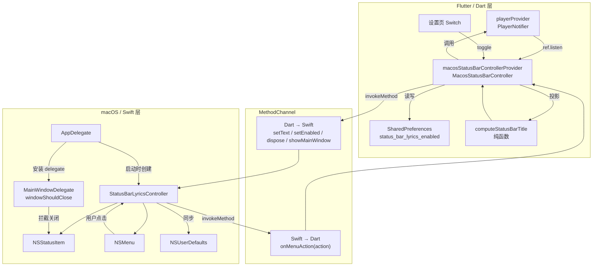
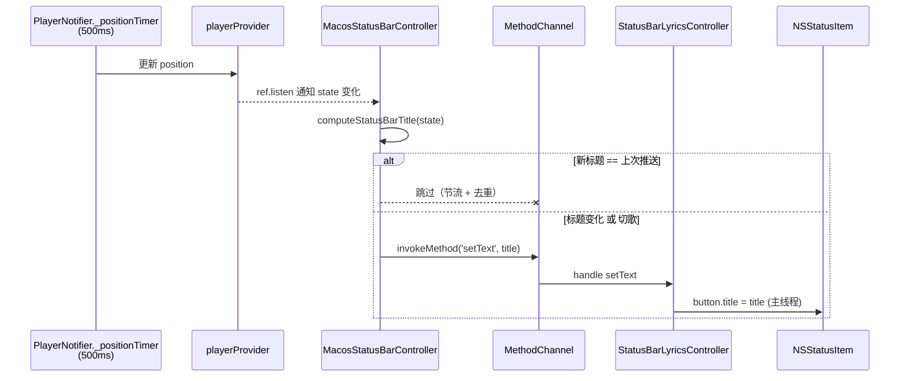
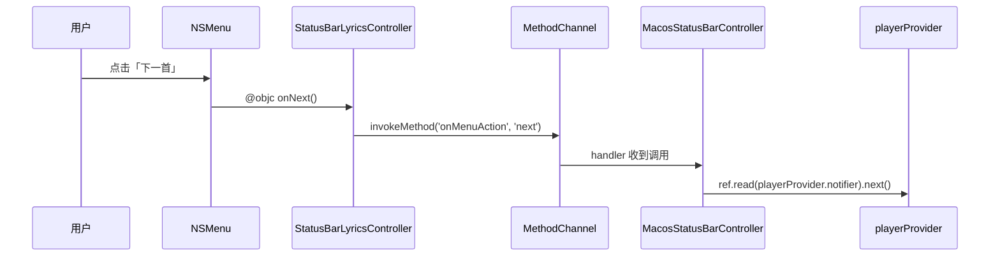
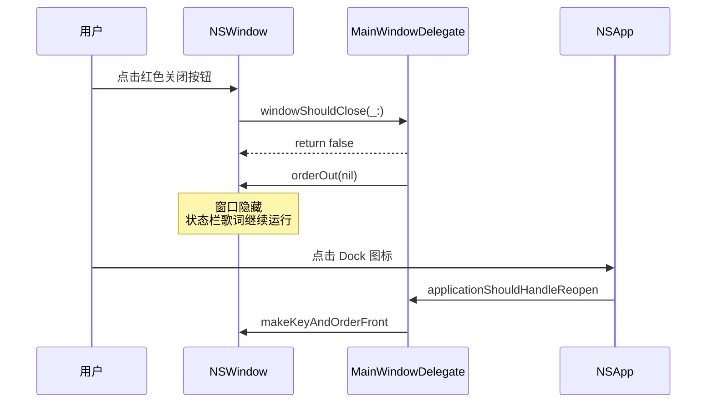
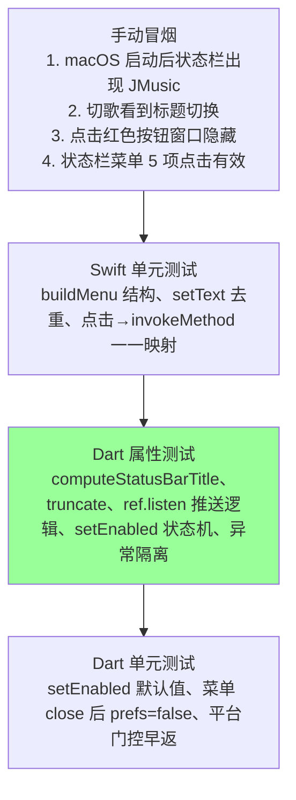

# 设计文档

## Overview

本设计为 macOS 端实现「菜单栏歌词」特性。整体采用 **Flutter（Dart）→ MethodChannel → Swift（Cocoa）** 的三层架构：

- **Dart 层**：由一个 Riverpod Provider（`MacosStatusBarController`）作为「桥接 Provider」，监听已有的 `playerProvider`，把 `PlayerState` 投影成「状态栏标题字符串」并以 500ms 节流推送给原生层；同时托管 `Status_Bar_Lyrics_Enabled` 偏好。
- **Channel 层**：使用全新的 `MethodChannel('com.jmusic.app/macos_status_bar')`，与既有的 `com.jmusic.app/tray`（Windows 桌面歌词/托盘）和 `com.jmusic.app/player`（Android 媒体）完全隔离。
- **Swift 层**：`StatusBarLyricsController` 单例持有 `NSStatusItem` 与 `NSMenu`，负责真正的菜单栏 UI、菜单回调以及主窗口关闭按钮拦截（隐藏而非退出）。

设计目标：
- **平台门控**：所有 macOS 专属逻辑被 `kIsWeb` 和 `Platform.isMacOS` 双重保护，其他平台行为零变化。
- **零侵入 PlayerNotifier**：不改 `PlayerNotifier` 的任何字段或方法签名；通过 `ref.listen(playerProvider, ...)` 在外部订阅。
- **可测**：把「PlayerState → 状态栏标题字符串」抽出为纯函数 `computeStatusBarTitle`，可以做属性测试。
- **生命周期清晰**：原生层自行管理 `NSStatusItem` 创建/移除、`NSWindowDelegate` 拦截关闭、`applicationWillTerminate` 清理。

## Architecture

### 三层结构



### 数据流

#### 流 A：歌词更新（Dart → Swift）



#### 流 B：菜单点击（Swift → Dart）



#### 流 C：主窗口关闭按钮（纯 Swift）



### 关键设计决策

| 决策 | 选择 | 理由 |
|---|---|---|
| Dart 侧节流位置 | 在 `MacosStatusBarController` 内部做去重，而不是在 `PlayerNotifier` 里 | `PlayerNotifier` 已经是 500ms tick；新增 controller 只在 state 变化时被通知，自然就是 500ms 频率，再加一次「与上次推送对比」即可 |
| 是否复用 `_positionTimer` | **复用**，不再启独立 Timer | `_positionTimer` 已经驱动 `state.position` 的 500ms 更新；`MacosStatusBarController` 通过 `ref.listen(playerProvider, …)` 自动收到通知，无需自己计时 |
| 切歌的即时更新 | 在 `ref.listen` 回调里检测 `previous.currentSong?.filePath != next.currentSong?.filePath`，若变化则**绕过去重**直接推送一次 | 满足 R3.8 的「无需等待下一个 500ms 周期」 |
| 状态栏图标 | **不设置** `button.image`，仅设置 `button.title` | 用户需求明确：只显示一行文字，无图标前缀 |
| 状态栏点击 | **不设置** `button.action`，使用 `statusItem.menu = …` 的默认菜单展开行为 | 用户需求明确：使用默认菜单展开，不自定义点击回调 |
| 菜单项数量 | 严格 5 项功能项 + 标题项 + 分隔符 | 用户需求明确：播放/暂停、上一首、下一首、显示主窗口、关闭状态栏歌词 |
| 关闭按钮行为 | `windowShouldClose` 返回 false 并 `orderOut` | 用户需求明确：关闭=隐藏，不退出 |
| 偏好持久化 | **Dart 侧 SharedPreferences 为唯一来源**；Swift 侧仅启动时通过 `Dart→Swift setEnabled` 接收 | 单一来源避免双写不一致；Swift 不直接读 NSUserDefaults |
| 通道命名空间 | 全新 `com.jmusic.app/macos_status_bar` | 与 Windows tray 隔离，防止处理逻辑相互污染 |
| 代码复用 | 不复用 `NativeUtils`，新建 `MacosStatusBarController` | `NativeUtils` 是 Windows 专属静态工具；macOS 路径需要持久化与节流，更适合做成 stateful Provider |

## Components and Interfaces

### Dart 侧

#### 1. `lib/providers/macos_status_bar.dart`（新增）

##### `class MacosStatusBarController`

桥接 Provider，作为 `NotifierProvider`。

```dart
class MacosStatusBarState {
  final bool enabled;          // Status_Bar_Lyrics_Enabled
  final String? lastPushedTitle; // 上次推送给原生的标题，用于去重
  const MacosStatusBarState({this.enabled = true, this.lastPushedTitle});
  MacosStatusBarState copyWith({bool? enabled, String? lastPushedTitle, bool clearLastPushedTitle = false});
}

class MacosStatusBarController extends Notifier<MacosStatusBarState> {
  static const _channel = MethodChannel('com.jmusic.app/macos_status_bar');
  static const _prefKey = 'status_bar_lyrics_enabled';
  static const int maxDisplayLength = 40;

  @override
  MacosStatusBarState build() {
    if (!_isMacos()) return const MacosStatusBarState(enabled: false);
    _channel.setMethodCallHandler(_onMethodCall);
    _restorePreferenceAndInit();         // 异步：读 SharedPreferences → setEnabled
    _subscribeToPlayer();                // ref.listen(playerProvider, …)
    ref.onDispose(_dispose);
    return const MacosStatusBarState(enabled: true); // 默认启用
  }

  // —— 设置项交互 ——
  Future<void> setEnabled(bool value);   // 持久化 + 通知原生 + 立即推送一次

  // —— 内部 ——
  Future<void> _onMethodCall(MethodCall call); // 处理 Swift → Dart 'onMenuAction'
  void _subscribeToPlayer();                   // 监听 playerProvider；调用 _pushIfChanged
  Future<void> _pushIfChanged(PlayerState s, {bool force = false}); // 节流去重 + invokeMethod
  Future<void> _dispose();                     // setEnabled(false) 类似的清理
  bool _isMacos() => !kIsWeb && Platform.isMacOS;
}

final macosStatusBarControllerProvider =
    NotifierProvider<MacosStatusBarController, MacosStatusBarState>(
  MacosStatusBarController.new,
);
```

##### `String computeStatusBarTitle(PlayerState state, {int maxLen = 40})`（纯函数，可测）

按 R3.4 / R3.5 / R3.6 / R3.7 计算最终展示字符串：

```
if state.currentSong == null              → "JMusic"
elif state.lyrics == null
  || state.lyrics.lines.isEmpty           → truncate("{title} - {artist}")
elif state.position.inMs < lines[0].timeMs → truncate("{title} - {artist}")
else                                       → truncate(currentLineText)

truncate(s) = s.runes.length <= maxLen ? s : (前 maxLen 个 rune) + '…'
```

Default_Title 常量：`'JMusic'`。截断按 Unicode 码点（`runes`）计算，不会切坏多字节字符。

##### 与 `playerProvider` 的关系

- `MacosStatusBarController` 在 `build()` 里调用 `ref.listen(playerProvider, (prev, next) { … })`。
- 回调里：
  1. 若 `state.enabled == false`，直接 return（满足 R6.4：禁用时不推送）。
  2. 若 `prev?.currentSong?.filePath != next.currentSong?.filePath`，触发 **`force=true`** 推送（满足 R3.8：切歌立即刷新）。
  3. 否则计算 `computeStatusBarTitle(next)`；若与 `state.lastPushedTitle` 不同，则 invokeMethod（满足 R3.2 / R3.3 去重）。
- **不重复创建定时器**：`PlayerNotifier._positionTimer` 已经在 500ms 周期更新 `state.position`，每次 state 变化都会经由 Riverpod 触发 `ref.listen` 回调；因此 `MacosStatusBarController` 自然以 500ms 节奏被驱动，不需要新建 Timer。

#### 2. 设置页改造（在 `lib/pages/home_page.dart` 或新增 settings widget）

新增一个 `SwitchListTile`：
- 仅当 `!kIsWeb && Platform.isMacOS` 时渲染。
- `value` 绑定到 `ref.watch(macosStatusBarControllerProvider).enabled`。
- `onChanged` 调用 `ref.read(macosStatusBarControllerProvider.notifier).setEnabled(v)`。

不引入新页面，最小侵入。

### Swift 侧

#### 1. `macos/Runner/StatusBarLyricsController.swift`（新增）

```swift
final class StatusBarLyricsController: NSObject {
    private let channel: FlutterMethodChannel
    private var statusItem: NSStatusItem?
    private var menu: NSMenu!
    private var enabled: Bool = false

    init(messenger: FlutterBinaryMessenger) {
        self.channel = FlutterMethodChannel(
            name: "com.jmusic.app/macos_status_bar",
            binaryMessenger: messenger)
        super.init()
        channel.setMethodCallHandler { [weak self] call, result in
            self?.handle(call, result: result)
        }
    }

    private func handle(_ call: FlutterMethodCall, result: @escaping FlutterResult) {
        switch call.method {
        case "setEnabled":
            let enabled = (call.arguments as? Bool) ?? false
            self.setEnabled(enabled)
            result(nil)
        case "setText":
            let text = (call.arguments as? String) ?? "JMusic"
            self.setText(text)
            result(nil)
        case "showMainWindow":
            self.showMainWindow()
            result(nil)
        case "dispose":
            self.tearDown()
            result(nil)
        default:
            result(FlutterMethodNotImplemented)
        }
    }

    // —— 生命周期 ——
    private func setEnabled(_ on: Bool) { /* 创建或移除 statusItem */ }
    private func setText(_ text: String) {
        DispatchQueue.main.async {
            guard let btn = self.statusItem?.button else { return }
            if btn.title != text { btn.title = text }    // R3.3 去重的 Swift 兜底
        }
    }
    private func tearDown() { /* 移除 statusItem，置 nil */ }

    // —— 菜单构建 ——
    private func buildMenu() -> NSMenu {
        // 标题项 + 分隔符 + 播放/暂停 + 上一首 + 下一首 + 分隔符 + 显示主窗口 + 分隔符 + 关闭状态栏歌词
    }

    // —— 菜单回调（@objc） ——
    @objc private func onTogglePlayPause() { invoke("togglePlayPause") }
    @objc private func onPrevious()        { invoke("previous") }
    @objc private func onNext()            { invoke("next") }
    @objc private func onShowMainWindow()  { showMainWindow() }
    @objc private func onCloseStatusBar()  { invoke("closeStatusBar"); tearDown() }

    private func invoke(_ action: String) {
        channel.invokeMethod("onMenuAction", arguments: action)
    }

    private func showMainWindow() {
        NSApp.activate(ignoringOtherApps: true)
        NSApp.windows.first?.makeKeyAndOrderFront(nil)
    }
}
```

要点：
- `statusItem = NSStatusBar.system.statusItem(withLength: NSStatusItem.variableLength)`；**不设置 `button.image`**，仅设置 `button.title`。
- `statusItem.menu = self.menu`，使用 NSStatusItem 的默认菜单展开行为（不设置 `action`/`target`）。
- 「关闭状态栏歌词」点击后：先 `invokeMethod('onMenuAction', 'closeStatusBar')` 通知 Dart 持久化关闭，再本地 `tearDown()` 立即移除 UI。Dart 收到 `closeStatusBar` 后写 `enabled=false` 到 SharedPreferences，并更新自身 state，使设置页开关同步（R5.5）。

#### 2. `macos/Runner/MainWindowDelegate.swift`（新增）

```swift
final class MainWindowDelegate: NSObject, NSWindowDelegate {
    func windowShouldClose(_ sender: NSWindow) -> Bool {
        sender.orderOut(nil)
        return false
    }
}
```

#### 3. `macos/Runner/AppDelegate.swift`（改造）

```swift
@main
class AppDelegate: FlutterAppDelegate {
    private var statusBar: StatusBarLyricsController?
    private let windowDelegate = MainWindowDelegate()

    override func applicationDidFinishLaunching(_ notification: Notification) {
        super.applicationDidFinishLaunching(notification)
        guard
            let window = NSApp.windows.first,
            let vc = window.contentViewController as? FlutterViewController
        else { return }

        window.delegate = windowDelegate
        statusBar = StatusBarLyricsController(messenger: vc.engine.binaryMessenger)
    }

    override func applicationShouldTerminateAfterLastWindowClosed(_ sender: NSApplication) -> Bool {
        // 红色按钮 = 隐藏窗口 → 即使所有窗口都隐藏，也不退出
        return false
    }

    override func applicationShouldHandleReopen(
        _ sender: NSApplication, hasVisibleWindows flag: Bool
    ) -> Bool {
        if !flag { NSApp.windows.first?.makeKeyAndOrderFront(nil) }
        return true
    }

    override func applicationWillTerminate(_ notification: Notification) {
        statusBar?.tearDown()    // R6.3
    }
}
```

注意 `applicationShouldTerminateAfterLastWindowClosed` 从 `true` 改为 `false`，配合「关闭按钮 = 隐藏窗口」的需求；用户仍可通过系统菜单 Cmd+Q 正常退出。

### MethodChannel 协议：`com.jmusic.app/macos_status_bar`

#### Dart → Swift

| 方法名 | 参数类型 | 语义 | 触发时机 |
|---|---|---|---|
| `setEnabled` | `bool` | 启用/禁用状态栏（创建或移除 NSStatusItem） | 启动恢复偏好时；用户切换设置项时；菜单「关闭状态栏歌词」由 Dart 回写时 |
| `setText` | `String` | 设置 NSStatusItem 标题 | 节流去重后的歌词更新 |
| `showMainWindow` | 无 | 等价于「显示主窗口」操作 | 设置页/未来扩展点（菜单内已有原生快捷路径） |
| `dispose` | 无 | 强制清理 NSStatusItem | Dart 侧 `ref.onDispose`（理论上不会发生，仅做兜底） |

返回值：所有方法 `result(nil)`；错误以 Swift 端记日志为主，不向 Dart 抛 `FlutterError`。

#### Swift → Dart

| 方法名 | 参数类型 | 语义 |
|---|---|---|
| `onMenuAction` | `String` ∈ `{togglePlayPause, previous, next, closeStatusBar}` | 用户点击了对应菜单项 |

Dart 侧 `_onMethodCall` 根据 action 字符串分派：

| action | Dart 行为 |
|---|---|
| `togglePlayPause` | `ref.read(playerProvider.notifier).togglePlayPause()` |
| `previous` | `ref.read(playerProvider.notifier).previous()` |
| `next` | `ref.read(playerProvider.notifier).next()` |
| `closeStatusBar` | `setEnabled(false)`（持久化 + 更新 state，UI 已由 Swift 端立即移除） |

注意「显示主窗口」由原生层直接处理，**不经过 Dart**（无需跨语言往返，更顺滑）。

## Data Models

### Dart 侧

#### `MacosStatusBarState`

```dart
class MacosStatusBarState {
  final bool enabled;           // 当前是否启用菜单栏歌词
  final String? lastPushedTitle; // 上次成功 setText 给原生的字符串（用于去重）
  const MacosStatusBarState({this.enabled = true, this.lastPushedTitle});
}
```

无 `currentSongFilePath` 字段；切歌检测在 `ref.listen` 回调里通过 `previous` 与 `next` 直接对比（更直接，避免冗余 state）。

#### 持久化键

| Key | Type | 默认值 | 存储位置 |
|---|---|---|---|
| `status_bar_lyrics_enabled` | `bool` | `true`（R5.4） | SharedPreferences（macOS 上 SharedPreferences 由 `path_provider` + plist 实现，自动落到 `~/Library/Preferences/<bundle-id>.plist`） |

#### 不修改的现有字段

`PlayerState`（`currentSong / lyrics / position / isPlaying / playMode / playlist`）保持不变（R7.4）。

### Swift 侧

无独立持久化数据。`enabled` 仅作为 `StatusBarLyricsController` 内的内存字段，启动时由 Dart 侧调用 `setEnabled` 注入。这避免了「Dart SharedPreferences 与 NSUserDefaults 双写不一致」的问题。

### 域常量

| 名称 | 值 | 含义 |
|---|---|---|
| `Default_Title` | `'JMusic'` | 无歌词/无歌曲时的占位 |
| `Max_Display_Length` | `40` | 状态栏标题字符数上限（按 Unicode 码点） |
| `Lyrics_Update_Interval` | `500ms` | 复用 `_positionTimer` 节奏，无独立常量 |
| Channel name | `'com.jmusic.app/macos_status_bar'` | MethodChannel 名 |
| Pref key | `'status_bar_lyrics_enabled'` | SharedPreferences 键 |


## Correctness Properties

*Property（性质）是对系统在所有合法执行下都应当保持的特征或行为的形式化陈述，它在「可读的需求文档」与「可机验的正确性保证」之间架起桥梁。本节列出本特性中可以做属性测试（PBT）的核心不变量。状态栏的 NSStatusItem 创建/移除等一次性 setup 走 SMOKE 测试；菜单项排列、回调一一映射、主窗口隐藏/显示等具体场景走 EXAMPLE 测试；下方 7 条属性才是真正适合 PBT 的部分。*

### Property 1: 标题计算的分支正确性

*For all* `PlayerState s`，`computeStatusBarTitle(s)` 满足以下不变量：
- 若 `s.currentSong == null`，结果恒为 `'JMusic'`；
- 否则若 `s.lyrics == null` 或 `s.lyrics.lines.isEmpty`，或 `s.position.inMilliseconds < s.lyrics.lines.first.timeMs`，则结果等于 `truncate('${s.currentSong.title} - ${s.currentSong.artist}', 40)`；
- 否则结果等于 `truncate(<最后一个 timeMs <= position 的 line 的 text>, 40)`。

**Validates: Requirements 2.2, 3.5, 3.6, 3.7**

### Property 2: 标题截断的长度上界与短字符串等价

*For all* 字符串 `s` 和最大长度 `n >= 0`，`truncate(s, n)` 满足：
- 若 `s.runes.length <= n`，则 `truncate(s, n) == s`；
- 否则 `truncate(s, n).runes.length == n + 1` 且以 `…`（U+2026）结尾，前 `n` 个码点等于 `s.runes.take(n)`。

**Validates: Requirements 3.4**

### Property 3: setText 的幂等去重与最终值正确性

*For all* 字符串序列 `[t1, t2, …, tk]`，依次调用 `StatusBarLyricsController.setText` 后：
- `statusItem.button.title == tk`（最终值正确）；
- 实际对 `button.title` 执行赋值的次数等于序列中相邻去重后的次数（`run-length count`），即对相同的连续重复值不重复赋值。

**Validates: Requirements 3.2, 3.3**

### Property 4: 切歌即时刷新（旁路去重）

*For all* `PlayerState` 状态序列 `[s_prev, s_next]`，若 `s_prev?.currentSong?.filePath != s_next.currentSong?.filePath`，则 `MacosStatusBarController` 在处理 `s_next` 后必至少向 channel 调用一次 `setText`，**即使** `computeStatusBarTitle(s_next)` 与 `lastPushedTitle` 字符串相等。

**Validates: Requirements 3.8**

### Property 5: 禁用态吞掉一切推送

*For all* `PlayerState` 状态序列 `S`，若在序列处理过程中的某一时刻调用了 `setEnabled(false)`（无论由设置页触发还是由菜单「关闭状态栏歌词」经 `onMenuAction('closeStatusBar')` 触发），则该时刻之后处理任何 `s ∈ S` 的尾段都不会向 channel 发送 `setText`；且 `controller.state.enabled == false`，并且至少向 channel 发送过一次 `setEnabled(false)`。

**Validates: Requirements 4.7, 5.3, 5.5, 6.4**

### Property 6: 启用切换的对称恢复

*For all* `PlayerState s` 与初始 `enabled=false`，调用 `setEnabled(true)` 后：
- `controller.state.enabled == true`；
- channel 收到至少一次 `setEnabled(true)`；
- 紧接着收到一次 `setText(computeStatusBarTitle(s))`（启用瞬间立即把当前歌词推送给原生层）；
- 后续若紧接着调用 `setEnabled(false)` 再 `setEnabled(true)` 任意次，最终 `enabled` 字段与最后一次调用的参数一致（toggle 是回到原状态的对称操作，外部可见状态可恢复）。

**Validates: Requirements 5.2, 5.3**

### Property 7: channel 异常隔离

*For all* `PlayerState` 状态序列 `S` 与任意一个会让 `channel.invokeMethod` 抛 `PlatformException` 或 `MissingPluginException` 的 mock，`MacosStatusBarController._pushIfChanged` 与 `setEnabled` 在处理整条序列时**不会向调用方抛出异常**；同时 `playerProvider` 的 `_positionTimer` 与 `state.position` 的更新流程不受影响。

**Validates: Requirements 6.1**

## Error Handling

### Dart 侧

| 失败场景 | 处理 |
|---|---|
| 非 macOS 平台调用 `MacosStatusBarController` 任何 public API | `_isMacos()` 守卫直接早返；无 channel 调用，无副作用，不抛 |
| `_channel.invokeMethod` 抛 `PlatformException` / `MissingPluginException` | `_pushIfChanged` / `setEnabled` 内 `try { … } catch (e) { print('[StatusBarLyrics] $e'); }`，吞掉异常；`_positionTimer` 不受影响（满足 R6.1） |
| SharedPreferences 读取失败 | `try/catch`，记日志后视作 key 不存在，使用默认值 `true`（满足 R5.4） |
| `playerProvider` 的 `togglePlayPause / previous / next` 在 `onMenuAction` 中抛错 | 在 handler 里 `try { ref.read(playerProvider.notifier).xxx() } catch (e) { print('[StatusBarLyrics] dispatch failed: $e'); }`；不传播到 channel handler 外，否则 Flutter 会把错误以 `MissingPluginException` 形式回传 Swift |

### Swift 侧

| 失败场景 | 处理 |
|---|---|
| `NSStatusBar.system.statusItem(...)` 返回 nil 或抛异常 | `setEnabled` 用 `do/catch` + nil 检查；记 `NSLog("[StatusBarLyrics] failed to create status item: ...")`；本次启动不重试（满足 R2.5）。`statusItem` 字段保持 nil，后续 `setText` 因为 `guard let btn = statusItem?.button` 自然短路 |
| `setText` 时 `statusItem == nil` | guard 短路，无操作；不抛错（满足 R6.2） |
| `showMainWindow` 时 `NSApp.windows.first == nil` | 早返；不影响 channel 返回值 |
| 任意 channel handler 内异常 | 整个 `handle(_:result:)` 包一层 `do { try … } catch { NSLog("[StatusBarLyrics] handler error: \\(error)"); result(nil) }`，保证向 Dart 返回 `nil` 而非 `FlutterError`（满足 R6.2） |
| `applicationWillTerminate` 时清理 | `statusBar?.tearDown()`；`tearDown` 自身要 `if let item = statusItem { NSStatusBar.system.removeStatusItem(item); statusItem = nil }`（满足 R6.3） |

### 日志规范

- Dart 侧统一使用前缀 `[StatusBarLyrics]`；
- Swift 侧统一使用前缀 `[StatusBarLyrics]` + `NSLog`；
- 高频路径（每 500ms 一次的 `_pushIfChanged`）的 catch 仅打印**首次错误**，避免日志洪水：以一个 `bool _hasLoggedPushError` 标记。

## Testing Strategy

本特性的测试分三层：**Dart 单元/属性测试**（占主体）、**Swift 单元测试**（菜单结构与回调分派）、**手动冒烟**（NSStatusBar 真实 UI 行为）。

### 测试金字塔



### 双轨测试方法

- **单元/示例测试（EXAMPLE）**：用于具体场景与边界
  - 默认值 `enabled=true`（R5.4）
  - 菜单结构与顺序（R4.2）
  - 菜单点击 → channel 调用一一映射（R4.3 / R4.4 / R4.5 / R4.6 / R4.8）
  - Dock 重新点击重新显示窗口（CL.2）

- **属性测试（PROPERTY）**：用于跨大量输入验证不变量
  - 上面 7 条 Correctness Properties

### Dart 端 PBT 配置

- **库**：`fast_check`（Dart 端 PBT；与 Hypothesis/QuickCheck 同源思想）。若团队偏好，可选 `glados`。pubspec 添加到 `dev_dependencies`。
- **运行**：`flutter test test/macos_status_bar_test.dart`
- **iteration 数**：每个属性测试至少 **100 次**迭代（fast_check 默认 100）。
- **生成器**：
  - `Song` 生成器：随机 title / artist / filePath（保证非空字符串与含 emoji / CJK / 长字符串的输入空间）。
  - `LyricsLine` 生成器：随机 `timeMs >= 0` 与任意 `text`。
  - `PlayerState` 生成器：组合 `currentSong?` / `lyrics?` / `position` / `isPlaying`。
  - 状态序列生成器：在 `[s1, s2, …, sk]` 中插入 `setEnabled(true/false)` 与切歌事件。

每个属性测试上方添加注释标签：

```dart
// Feature: macos-status-bar-lyrics, Property 1: 标题计算的分支正确性
fastCheck.property('computeStatusBarTitle 覆盖所有分支', ...);
```

### Swift 端单元测试

- **位置**：`macos/RunnerTests/StatusBarLyricsControllerTests.swift`（沿用既有 RunnerTests target）
- **测试用例**：
  - `testBuildMenuStructure`：断言 `menu.items.map(...)` 顺序与 9 项结构（R4.2，EXAMPLE）
  - `testSetTextDeduplication`：连续相同 `setText` 调用不重复赋值（R3.3 的 Swift 兜底；可做小规模迭代）
  - `testMenuActionDispatchesToChannel`：注入 mock `FlutterMethodChannel`，模拟点击四个动作菜单项，断言 invokeMethod 调用参数（R4.3-4.5、4.7）
  - `testWindowShouldCloseHidesWindow`：构造 NSWindow，调用 delegate，断言返回 false 且 `isVisible=false`（CL.1 的 Swift 部分）
  - `testTearDownRemovesStatusItem`：创建后 tearDown，断言 `NSStatusBar.system.statusItems.contains(item) == false`（R6.3）

### 手动冒烟用例

| 用例 | 期望结果 |
|---|---|
| 启动应用 | 状态栏出现 `JMusic` 文字（无图标），无歌曲时保持 |
| 选歌播放 | 状态栏立即显示「歌曲 - 艺术家」，500ms 内切到当前行歌词 |
| 切下一首 | 状态栏在切歌瞬间立即更新，无 500ms 等待 |
| 长歌词 / emoji | 截断到 40 个码点 + `…`，无切坏字符 |
| 点击状态栏文字 | 默认菜单展开，5 项功能 + 标题项 + 分隔符 |
| 点击「播放/暂停」「上一首」「下一首」 | 主窗口播放器对应行为正确 |
| 点击「显示主窗口」 | 主窗口显示在前台 |
| 点击「关闭状态栏歌词」 | 状态栏立即消失；设置项开关同步为关 |
| 设置项开 → 关 → 开 | 状态栏对应消失/重现，重启后状态恢复 |
| 主窗口红色按钮 | 窗口隐藏，应用继续运行；状态栏歌词继续刷新 |
| 点击 Dock 图标 | 主窗口重新显示 |
| Cmd+Q | 应用退出；状态栏 item 立即移除（无残留） |

### 与 Windows tray 的代码隔离验证

- **静态约束**：`grep -r 'com.jmusic.app/tray' lib/providers/macos_status_bar.dart` 应返回空。
- **静态约束**：`grep -r 'com.jmusic.app/macos_status_bar' lib/` 应仅在 `macos_status_bar.dart` 与设置 widget 出现。
- **运行时约束**：在 macOS 启动后，对 `com.jmusic.app/tray` 通道做一次 invokeMethod（如 `getHwnd`），确认仍返回 `MissingPluginException`（macOS 上 Windows 通道未注册），而 `com.jmusic.app/macos_status_bar` 调用正常返回 `nil`。

### 平台门控的回归保护

在 CI（Linux runner）执行 `flutter test`，断言 `MacosStatusBarController` 在非 macOS 平台：
- `setEnabled(true)` 不抛、不调用 `MethodChannel`；
- `state.enabled` 始终为 `false`；
- 不会在 `playerProvider` 上注册任何额外监听副作用（通过 mock channel 计数验证）。

## 与 Windows tray 通道的代码复用考量

经评估，本特性**不与 Windows tray 共享通道或工具类**，原因：

1. **职责差异**：`com.jmusic.app/tray` 同时承担「桌面悬浮歌词窗口」「托盘菜单」「窗口标题更新」三类职责；macOS 只做「状态栏菜单」单一职责。混在一起会让 Swift 端处理大量空实现的方法。
2. **数据模型差异**：Windows tray `updateLyrics` 推送 `{current, next}`（双行），macOS 状态栏只推送一行；强行复用需要改协议。
3. **节流模型差异**：Windows tray 的 `updateLyricsOverlay` 当前由 `_positionTimer` 直接调用，没有去重；macOS 路径在 `MacosStatusBarController` 内做了去重 + 切歌旁路；语义不同。
4. **持久化差异**：Windows tray 没有「启用/禁用」开关；macOS 路径有 `Status_Bar_Lyrics_Enabled` 偏好，且会通过菜单回写。

**保留的复用点**：
- 都使用 `MethodChannel`，调用样式一致。
- 都遵循「Dart 侧驱动 → 原生层渲染」的同步方向。
- 错误日志前缀风格一致（`[StatusBarLyrics]` 与 Windows 端的 `[Tray]`）。

未来若要做 Windows 状态栏歌词或 macOS 桌面悬浮歌词，可考虑抽出共同接口 `LyricsRenderer { void update(String) }`，但本期不做。

## Phase Completion

设计文档已完成。请审阅以下重点，必要时反馈：

- 三层架构与 MethodChannel 协议（`com.jmusic.app/macos_status_bar`，setEnabled / setText / dispose / showMainWindow ; onMenuAction）
- Dart 端复用 `_positionTimer` + `ref.listen` 节奏，无独立 Timer
- 主窗口关闭按钮：`windowShouldClose` 返回 false + `orderOut`，配合 `applicationShouldTerminateAfterLastWindowClosed = false`
- 偏好持久化单一来源：Dart SharedPreferences；Swift 不直接读 NSUserDefaults，启动时由 Dart 注入
- 7 条 Correctness Properties，覆盖标题计算、截断、去重、切歌、禁用、切换对称、异常隔离
- 与 Windows tray 的隔离策略与未来抽象点

如确认无误，请在 UI 中点击进入下一阶段（Tasks）。如需调整，告知具体方向我将迭代修改。
