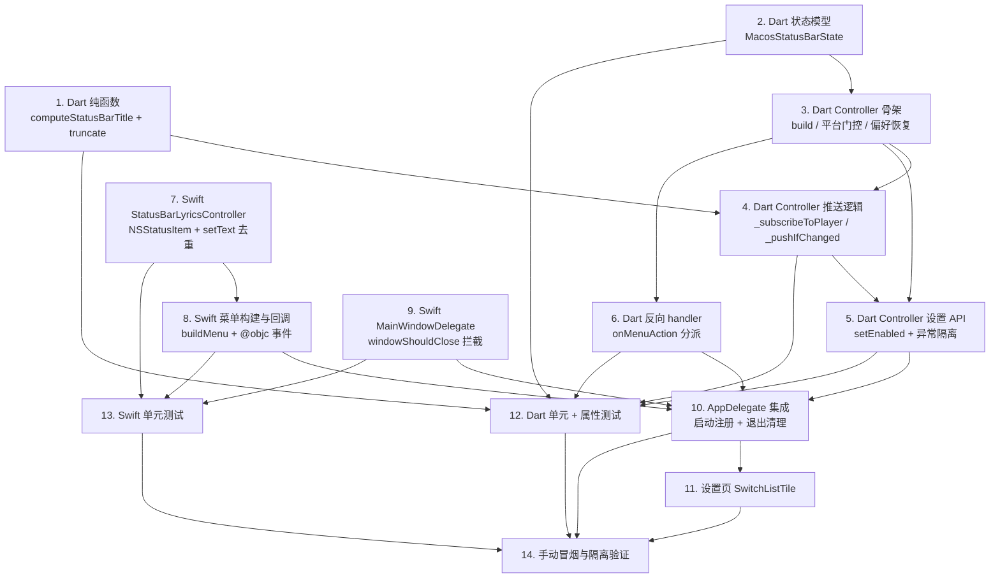

# Implementation Plan: macos-status-bar-lyrics

## Overview

按依赖顺序自底向上推进：先 Dart 端纯函数与状态模型 → MethodChannel 协议常量 → Dart Controller → Swift 端 UI 与 Channel handler → AppDelegate 集成 → 设置页 UI → 测试。每个任务都对应明确的产出物（文件 / 类 / 方法），并标注追溯到 `requirements.md` 的需求条目；属性测试任务额外标注追溯到 `design.md` 的 Correctness Property 编号。

工作流将任务分为可并行执行的「波次（wave）」：同一波次内的任务相互独立，可由不同执行单元同时推进；跨波次保留严格依赖。下方 `Task Dependency Graph` 同时给出 Mermaid 可视化与机器可读的 JSON 波次定义。

## Task Dependency Graph



```json
{
  "waves": [
    {
      "wave": 1,
      "description": "无依赖的基础单元：纯函数、状态模型、Swift 基础类、窗口委托",
      "tasks": ["1", "2", "7", "9"]
    },
    {
      "wave": 2,
      "description": "在 wave 1 之上构建 Dart Controller 骨架与 Swift 菜单",
      "tasks": ["3", "8"]
    },
    {
      "wave": 3,
      "description": "Controller 行为层：推送、设置 API、反向 handler",
      "tasks": ["4", "5", "6"]
    },
    {
      "wave": 4,
      "description": "原生入口集成 + 设置页 UI",
      "tasks": ["10", "11"]
    },
    {
      "wave": 5,
      "description": "测试：Dart 单元/属性 + Swift 单元",
      "tasks": ["12", "13"]
    },
    {
      "wave": 6,
      "description": "端到端冒烟与平台隔离验证",
      "tasks": ["14"]
    }
  ]
}
```

## Tasks

- [x] 1. Dart 端实现纯函数 `computeStatusBarTitle` 与 `truncateByRunes`
  - 新建文件 `lib/providers/macos_status_bar.dart`
  - 实现顶层常量 `kStatusBarDefaultTitle = 'JMusic'`、`kStatusBarMaxDisplayLength = 40`、`kMacosStatusBarChannel = 'com.jmusic.app/macos_status_bar'`、`kStatusBarLyricsEnabledPrefKey = 'status_bar_lyrics_enabled'`
  - 实现纯函数 `String truncateByRunes(String s, int maxLen)`：按 Unicode 码点截断，长度超出则取前 `maxLen` 个 rune 并追加 `…`（U+2026）
  - 实现纯函数 `String computeStatusBarTitle(PlayerState state, {int maxLen = 40})`，覆盖以下分支：
    - `currentSong == null` → 返回 `kStatusBarDefaultTitle`
    - `lyrics == null` 或 `lyrics.lines.isEmpty` 或 `position.inMilliseconds < lines.first.timeMs` → 返回 `truncateByRunes('${title} - ${artist}', maxLen)`
    - 否则取最后一个 `timeMs <= position.inMilliseconds` 的歌词行文本，返回 `truncateByRunes(text, maxLen)`
  - 不引入对 `MethodChannel` / `SharedPreferences` 的依赖（保持纯函数可测）
  - _Requirements: 2.2, 3.4, 3.5, 3.6, 3.7_
  - _Validates Property: 1, 2_

- [x] 2. Dart 端实现状态模型 `MacosStatusBarState`
  - 在 `lib/providers/macos_status_bar.dart` 中定义 `class MacosStatusBarState`，字段：`final bool enabled`、`final String? lastPushedTitle`
  - 提供构造函数 `const MacosStatusBarState({this.enabled = true, this.lastPushedTitle})`
  - 提供 `copyWith({bool? enabled, String? lastPushedTitle, bool clearLastPushedTitle = false})`，当 `clearLastPushedTitle == true` 时显式清空字段
  - 提供 `==` / `hashCode`（用于测试断言与 Riverpod 去重）
  - _Requirements: 5.4_

- [x] 3. Dart 端实现 `MacosStatusBarController` 骨架与平台门控
  - 在 `lib/providers/macos_status_bar.dart` 中定义 `class MacosStatusBarController extends Notifier<MacosStatusBarState>`
  - 实现 `bool _isMacos() => !kIsWeb && Platform.isMacOS`
  - 实现 `MacosStatusBarState build()`：
    - 非 macOS 直接返回 `MacosStatusBarState(enabled: false)`，不注册任何监听器、不调用 channel
    - macOS 时设置 `_channel.setMethodCallHandler(_onMethodCall)`、调用 `_restorePreferenceAndInit()` 与 `_subscribeToPlayer()`、调用 `ref.onDispose(_dispose)`、返回 `MacosStatusBarState(enabled: true)`
  - 实现 `Future<void> _restorePreferenceAndInit()`：异步读 `SharedPreferences` 中的 `kStatusBarLyricsEnabledPrefKey`（不存在视为 `true`），将结果同步到 `state.enabled` 并调用一次 `setEnabled(restored)` 让 Swift 创建/移除 NSStatusItem；外层 `try/catch` 吞掉异常，缺省视为启用
  - 暴露 `final macosStatusBarControllerProvider = NotifierProvider<MacosStatusBarController, MacosStatusBarState>(MacosStatusBarController.new)`
  - _Requirements: 1.1, 1.2, 1.3, 5.4, 7.1_

- [x] 4. Dart 端实现 `_subscribeToPlayer` 与 `_pushIfChanged` 推送逻辑
  - 在 `MacosStatusBarController` 中实现 `void _subscribeToPlayer()`：
    - `ref.listen<PlayerState>(playerProvider, (prev, next) { … })`
    - 回调中先判断 `state.enabled == false` → 直接 return
    - 然后判断 `prev?.currentSong?.filePath != next.currentSong?.filePath` → 调用 `_pushIfChanged(next, force: true)`
    - 否则 `_pushIfChanged(next, force: false)`
  - 实现 `Future<void> _pushIfChanged(PlayerState s, {bool force = false})`：
    - 计算 `final title = computeStatusBarTitle(s)`
    - 当 `!force && title == state.lastPushedTitle` 时直接 return（去重）
    - 否则 `try { await _channel.invokeMethod('setText', title); state = state.copyWith(lastPushedTitle: title); } catch (e) { … }`，异常仅打印首次（用 `_hasLoggedPushError` 标志位），日志前缀 `[StatusBarLyrics]`
  - _Requirements: 3.1, 3.2, 3.3, 3.8, 6.1, 6.4_
  - _Validates Property: 3, 4, 7_

- [x] 5. Dart 端实现 `setEnabled` 与 `_dispose`
  - 实现 `Future<void> setEnabled(bool value)`：
    - 非 macOS 早返
    - 写 `SharedPreferences[kStatusBarLyricsEnabledPrefKey] = value`（异常 try/catch + 日志，但仍继续）
    - 更新 `state = state.copyWith(enabled: value, clearLastPushedTitle: !value)`
    - `try { await _channel.invokeMethod('setEnabled', value); } catch (e) { … }`
    - 当 `value == true` 时立即读取 `ref.read(playerProvider)` 调用 `_pushIfChanged(current, force: true)`，确保启用瞬间标题正确（满足 R5.2、Property 6）
  - 实现 `Future<void> _dispose()`：调用 `_channel.invokeMethod('dispose')`，异常吞掉
  - _Requirements: 5.2, 5.3, 5.4, 5.5, 6.1, 6.4_
  - _Validates Property: 5, 6, 7_

- [x] 6. Dart 端实现 `_onMethodCall`：分派 `onMenuAction`
  - 实现 `Future<dynamic> _onMethodCall(MethodCall call)`：
    - 仅处理 `call.method == 'onMenuAction'`，其他方法返回 `null`
    - `final action = call.arguments as String`
    - 用 `try { switch action { … } } catch (e) { … }` 包裹分派，避免抛回 channel：
      - `'togglePlayPause'` → `ref.read(playerProvider.notifier).togglePlayPause()`
      - `'previous'` → `ref.read(playerProvider.notifier).previous()`
      - `'next'` → `ref.read(playerProvider.notifier).next()`
      - `'closeStatusBar'` → `await setEnabled(false)`（持久化 + 状态同步，UI 已由 Swift 端就地移除）
    - 异常分支记录 `[StatusBarLyrics] dispatch failed: …`，并 `return null`
  - _Requirements: 4.3, 4.4, 4.5, 4.7, 4.8, 5.5, 6.2_

- [x] 7. Swift 端实现 `StatusBarLyricsController` 基础与 `setText` 去重
  - 新建文件 `macos/Runner/StatusBarLyricsController.swift`
  - 定义 `final class StatusBarLyricsController: NSObject`，字段：`let channel: FlutterMethodChannel`、`var statusItem: NSStatusItem?`、`var menu: NSMenu!`、`var enabled: Bool`
  - 构造函数注入 `FlutterBinaryMessenger`，创建 channel `'com.jmusic.app/macos_status_bar'`，并 `channel.setMethodCallHandler { … }` 把方法分派到 `handle(_:result:)`
  - 实现 `handle(_:result:)`，分派 `setEnabled` / `setText` / `showMainWindow` / `dispose`，整体包 `do/catch` 兜底，错误日志前缀 `[StatusBarLyrics]`，向 Dart 始终 `result(nil)`，未实现方法返回 `FlutterMethodNotImplemented`
  - 实现 `setEnabled(_:)`：true → 创建 `NSStatusBar.system.statusItem(withLength: NSStatusItem.variableLength)`，**不设置 `button.image`**，初始 `button.title = "JMusic"`，绑定 `statusItem.menu = buildMenu()`；false → 调用 `tearDown()`
  - 实现 `setText(_:)`：在 `DispatchQueue.main.async` 内 `guard let btn = statusItem?.button else { return }`，仅当 `btn.title != text` 时赋值（去重兜底）
  - 实现 `tearDown()`：`if let item = statusItem { NSStatusBar.system.removeStatusItem(item); statusItem = nil }`
  - 实现 `showMainWindow()`：`NSApp.activate(ignoringOtherApps: true)`；遍历 `NSApp.windows` 选第一个非 status item window 调用 `makeKeyAndOrderFront(nil)`
  - 错误处理：`statusItem` 创建后 `if statusItem == nil { NSLog("[StatusBarLyrics] failed to create status item"); return }`，本次启动不重试
  - _Requirements: 1.1, 2.1, 2.2, 2.3, 2.4, 2.5, 3.2, 3.3, 4.6, 6.2, 7.2, 7.3_

- [x] 8. Swift 端实现 `buildMenu` 与菜单点击回调
  - 在 `StatusBarLyricsController` 中实现 `func buildMenu() -> NSMenu`，按需求 R4.2 顺序构建 9 项：
    1. 当前歌曲信息（`isEnabled = false` 的标题项；初始文案为 "未在播放"）
    2. 分隔符
    3. "播放 / 暂停" → `@objc func onTogglePlayPause()`
    4. "上一首" → `@objc func onPrevious()`
    5. "下一首" → `@objc func onNext()`
    6. 分隔符
    7. "显示主窗口" → `@objc func onShowMainWindow()`
    8. 分隔符
    9. "关闭状态栏歌词" → `@objc func onCloseStatusBar()`
  - 每个 `NSMenuItem` 绑定 `target = self` 与对应 `action` selector
  - 实现 `private func invoke(_ action: String) { channel.invokeMethod("onMenuAction", arguments: action) }`
  - 各回调实现：
    - `onTogglePlayPause` → `invoke("togglePlayPause")`
    - `onPrevious` → `invoke("previous")`
    - `onNext` → `invoke("next")`
    - `onShowMainWindow` → 直接调用 `showMainWindow()`，**不经过 Dart 往返**
    - `onCloseStatusBar` → `invoke("closeStatusBar")` 后立即 `tearDown()`（让 UI 立刻消失，Dart 侧再异步持久化）
  - **不为 `statusItem.button` 设置 `action`/`target`**：依赖 NSStatusItem 默认菜单展开行为
  - 切歌 / 标题更新时同步刷新菜单第 1 项（标题项）：扩展 `setText(_:)` 时同步设置 `menu.items[0].title = currentTitle`，或单独提供一个 `setMenuTitleItem(_:)` 方法（实现可任选）
  - _Requirements: 4.1, 4.2, 4.3, 4.4, 4.5, 4.6, 4.7_

- [x] 9. Swift 端实现 `MainWindowDelegate` 拦截关闭按钮
  - 新建文件 `macos/Runner/MainWindowDelegate.swift`
  - 定义 `final class MainWindowDelegate: NSObject, NSWindowDelegate`
  - 实现 `func windowShouldClose(_ sender: NSWindow) -> Bool`：调用 `sender.orderOut(nil)`，返回 `false`
  - 不引入对 `StatusBarLyricsController` 的耦合（保持单一职责）
  - _Requirements: 6.3 间接相关；本任务直接为体验决策落地（关闭=隐藏）_

- [x] 10. AppDelegate 集成与生命周期清理
  - 改造 `macos/Runner/AppDelegate.swift`：
    - 持有 `private var statusBar: StatusBarLyricsController?` 与 `private let windowDelegate = MainWindowDelegate()`
    - 重写 `applicationDidFinishLaunching(_:)`：调用 `super.applicationDidFinishLaunching`；获取 `NSApp.windows.first` 与其 `contentViewController as? FlutterViewController`；为 window 设置 `delegate = windowDelegate`；用 `vc.engine.binaryMessenger` 创建 `StatusBarLyricsController`
    - 重写 `applicationShouldTerminateAfterLastWindowClosed(_:) -> Bool`，返回 `false`（关闭按钮 = 隐藏，不退出）
    - 重写 `applicationShouldHandleReopen(_:hasVisibleWindows:) -> Bool`：`if !flag { NSApp.windows.first?.makeKeyAndOrderFront(nil); NSApp.activate(ignoringOtherApps: true) }`，返回 `true`
    - 重写 `applicationWillTerminate(_:)`：`statusBar?.tearDown()`
  - 不修改 `MainFlutterWindow.swift`（除非确认 `NSApp.windows.first` 拿不到 FlutterViewController；如有必要在该文件初始化时把 window 引用传给 AppDelegate）
  - _Requirements: 1.1, 6.3, 7.2_

- [x] 11. 在设置界面新增 "在菜单栏显示歌词" 开关
  - 在 `lib/pages/home_page.dart`（或合适的设置 widget）新增 `Consumer` 包裹的 `SwitchListTile`：
    - 仅当 `!kIsWeb && Platform.isMacOS` 时渲染（其他平台返回 `SizedBox.shrink()`）
    - `title: const Text('在菜单栏显示歌词')`
    - `value: ref.watch(macosStatusBarControllerProvider).enabled`
    - `onChanged: (v) => ref.read(macosStatusBarControllerProvider.notifier).setEnabled(v)`
  - 在 home_page 顶部确保已 `import 'package:jmusic/providers/macos_status_bar.dart'`
  - 不创建新页面，最小侵入
  - _Requirements: 5.1, 5.2, 5.3, 5.5_

- [x] 12. Dart 单元测试 + 属性测试
  - 在 `pubspec.yaml` 的 `dev_dependencies` 加入 `fast_check`（如团队偏好可改 `glados`，注意保持后续测试代码一致）
  - 新建 `test/macos_status_bar_test.dart`，使用 `TestDefaultBinaryMessengerBinding` mock channel `com.jmusic.app/macos_status_bar`
  - 单元（EXAMPLE）测试：
    - 默认值：`build()` 后 `state.enabled` 在非 macOS 平台为 `false`，channel 未被调用 → 验证平台门控（_Requirements: 1.2, 5.4_）
    - 菜单 `closeStatusBar` 收到后 `enabled` 变为 `false`，且 SharedPreferences 写入 `false`（_Requirements: 4.7, 5.5_）
    - 启用瞬间立即推送一次 `setText(computeStatusBarTitle(currentState))`（_Requirements: 5.2_）
  - 属性（PROPERTY）测试，每个至少 100 次迭代，每个测试上方注释 `// Feature: macos-status-bar-lyrics, Property N: ...`：
    - Property 1：`computeStatusBarTitle` 分支正确性（_Requirements: 2.2, 3.5, 3.6, 3.7_，_Validates Property: 1_）
    - Property 2：`truncateByRunes` 长度上界与短字符串等价（_Requirements: 3.4_，_Validates Property: 2_）
    - Property 3：`_pushIfChanged` 的去重（连续相同 title 序列只触发首个 `setText`）（_Requirements: 3.2, 3.3_，_Validates Property: 3_）
    - Property 4：切歌旁路去重（不同 `filePath` 必触发推送，即使 title 字符串相同）（_Requirements: 3.8_，_Validates Property: 4_）
    - Property 5：禁用态吞掉一切推送（`setEnabled(false)` 后任何 `playerProvider` 状态序列不触发 `setText`，且至少一次 `setEnabled(false)` 被发出）（_Requirements: 4.7, 5.3, 5.5, 6.4_，_Validates Property: 5_）
    - Property 6：启用切换的对称恢复（_Requirements: 5.2, 5.3_，_Validates Property: 6_）
    - Property 7：channel 异常隔离（mock 让 `invokeMethod` 抛 `PlatformException`，Dart Controller 不抛、`playerProvider` 状态流不受影响）（_Requirements: 6.1_，_Validates Property: 7_）
  - 运行命令：`flutter test test/macos_status_bar_test.dart`
  - _Requirements: 6.1_

- [x] 13. Swift 端单元测试
  - 在既有 RunnerTests target 下新建 `macos/RunnerTests/StatusBarLyricsControllerTests.swift`
  - 用 mock 的 `FlutterBinaryMessenger` / `FlutterMethodChannel`（自定义 `RecordingMessenger` 收集 `invokeMethod` 调用）
  - 用例（EXAMPLE）：
    - `testBuildMenuStructure`：`buildMenu()` 后 `menu.items.count == 9`，验证顺序与文案（R4.2）
    - `testSetTextDeduplication`：连续相同 `setText("abc")` 三次，`button.title` 仅被赋值一次（用 KVO 计数或子类 mock）（R3.3）
    - `testMenuActionDispatchesToChannel`：依次模拟点击播放/暂停、上一首、下一首、关闭状态栏歌词四个菜单项，断言 `invokeMethod` 收到 `("onMenuAction", "togglePlayPause" / "previous" / "next" / "closeStatusBar")`（R4.3-4.5、4.7）
    - `testShowMainWindowDoesNotInvokeChannel`：点击「显示主窗口」时 `invokeMethod` 调用次数为 0（R4.6）
    - `testWindowShouldCloseHidesWindow`：构造 NSWindow，调 `MainWindowDelegate.windowShouldClose(_:)` 应返回 false 且 `window.isVisible == false`
    - `testTearDownRemovesStatusItem`：`setEnabled(true)` 后再 `tearDown`，`NSStatusBar.system` 不再持有该 item（R6.3）
  - _Requirements: 2.1, 2.3, 3.3, 4.2, 4.3, 4.4, 4.5, 4.6, 4.7, 6.3_

- [x] 14. 手动冒烟与隔离验证
  - 在 macOS 真机执行下列冒烟用例并记录截图 / 行为：
    - 启动 → 状态栏出现 `JMusic` 文字、无图标
    - 选歌播放 → 状态栏立即显示 `歌曲 - 艺术家`，500ms 内切到当前行歌词
    - 切下一首 → 状态栏在切歌瞬间立即更新（不等 500ms）
    - 长歌词 / 含 emoji / CJK 截断到 40 个码点 + `…`，无切坏字符
    - 状态栏文字点击 → 默认菜单展开，9 项结构正确
    - 点击 5 个功能菜单项 → 行为正确
    - 点击「关闭状态栏歌词」→ 状态栏立即消失；重新打开设置页，开关同步为关
    - 设置项开 → 关 → 开，观察 NSStatusItem 对应消失/重现；重启应用，状态恢复
    - 主窗口红色按钮 → 窗口隐藏，应用继续运行；状态栏歌词继续刷新；点击 Dock 图标主窗口重现
    - Cmd+Q 退出 → 状态栏 item 立即消失，无残留
  - 隔离验证（不破坏既有特性）：
    - `grep -r 'com.jmusic.app/tray' lib/providers/macos_status_bar.dart` 应为空
    - `grep -r 'com.jmusic.app/macos_status_bar' lib/` 应仅出现在 `lib/providers/macos_status_bar.dart` 与设置页改造文件
    - macOS 启动后 Windows tray 通道不应被调用（在 `_positionTimer` 路径中既有的 `NativeUtils.updateLyricsOverlay` 行为不变；可临时加日志验证后回滚）
  - 在非 macOS 平台（Linux / Windows）跑一遍 `flutter test`，确认全部通过（CI 平台门控回归保护）
  - _Requirements: 1.1, 1.2, 1.3, 6.3, 7.1, 7.2, 7.3, 7.4_

## Notes

- 全部 Dart 文件遵循项目既有的 Riverpod 3.x `Notifier` 写法（参考 `lib/providers/app_providers.dart` 的 `PlayerNotifier`）。
- 平台门控双重保护：`!kIsWeb && Platform.isMacOS`，非 macOS 端 `MacosStatusBarController.build()` 直接返回 `enabled=false` 的状态，不注册 channel handler、不订阅 `playerProvider`，确保零副作用。
- 偏好持久化以 Dart 端 `SharedPreferences` 为唯一来源；Swift 端不直接读 `NSUserDefaults`，启动时由 Dart 通过 `setEnabled` 注入。
- 错误隔离：Dart 侧的所有 `_channel.invokeMethod` 都包 `try/catch`，首次失败打印日志（`[StatusBarLyrics]` 前缀）后置 `_hasLoggedPushError = true`，避免每 500ms 一次的日志洪水；Swift 侧 handler 整体 `do/catch`，向 Dart 始终 `result(nil)`，不抛 `FlutterError`。
- 与 Windows tray（`com.jmusic.app/tray`）完全隔离：通道、Notifier、协议、状态全部独立，禁止共用 `NativeUtils.updateLyricsOverlay`。
- 「关闭主窗口 = 隐藏（不退出）」是用户确认的体验决策，落地在 task 9（`MainWindowDelegate.windowShouldClose`）与 task 10（`applicationShouldTerminateAfterLastWindowClosed = false` + `applicationShouldHandleReopen`）。
- 状态栏菜单严格 9 项（含分隔符与不可点击的标题项），无图标前缀，`button.title` 唯一可视元素；不为 `button` 设置 `action/target`，使用 NSStatusItem 默认菜单展开行为。
- `fast_check` 是 Dart 端做属性测试的首选库（与 Hypothesis/QuickCheck 同源思想）。如团队最终选 `glados`，task 12 中所有属性测试样板需要相应改写，但 7 条 Property 的语义保持不变。
- 测试任务（task 12 / 13）允许在实现任务（task 1–11）部分完成时就开始单元层验证；属性测试与冒烟必须在所有实现任务（特别是 task 5、task 8、task 10）完成后再跑全量。

## 阶段产出物清单

实现完成后将产生以下新增 / 修改文件：

| 路径 | 类型 | 主要内容 |
|---|---|---|
| `lib/providers/macos_status_bar.dart` | 新增 | 常量、`MacosStatusBarState`、`MacosStatusBarController`、`computeStatusBarTitle`、`truncateByRunes` |
| `lib/pages/home_page.dart` | 修改 | 设置项 `SwitchListTile`（仅 macOS） |
| `pubspec.yaml` | 修改 | `dev_dependencies` 增加 `fast_check`（或 `glados`） |
| `macos/Runner/StatusBarLyricsController.swift` | 新增 | NSStatusItem + NSMenu + channel handler |
| `macos/Runner/MainWindowDelegate.swift` | 新增 | `windowShouldClose` 拦截关闭按钮 |
| `macos/Runner/AppDelegate.swift` | 修改 | 启动注册 controller、`shouldTerminateAfterLastWindowClosed = false`、`applicationShouldHandleReopen`、退出 tearDown |
| `test/macos_status_bar_test.dart` | 新增 | 单元 + 属性测试（覆盖 7 条 Correctness Properties） |
| `macos/RunnerTests/StatusBarLyricsControllerTests.swift` | 新增 | Swift 端单元测试 |

## 不在本期范围

- Windows / Linux 端状态栏歌词
- macOS 桌面悬浮歌词窗口
- 状态栏菜单的额外项（收藏、当前歌曲信息以外的元数据、打开设置等）
- 状态栏文字的自定义点击行为（保留 NSStatusItem 默认菜单展开）
- 与 Windows tray 共用的 `LyricsRenderer` 抽象（设计文档列为未来工作）
