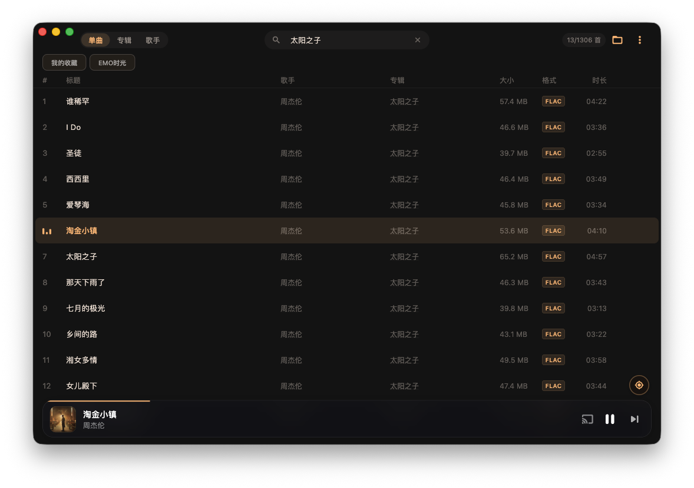
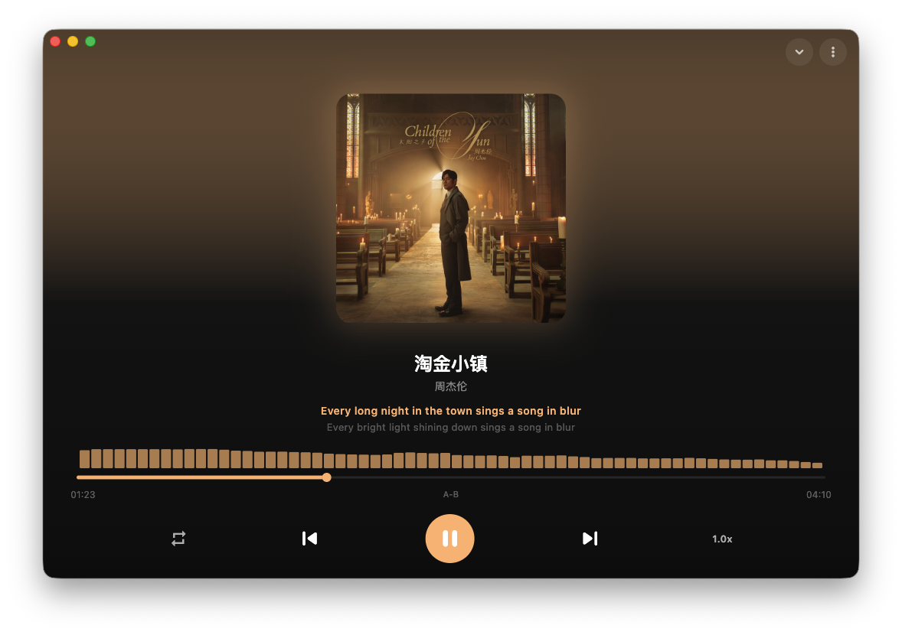
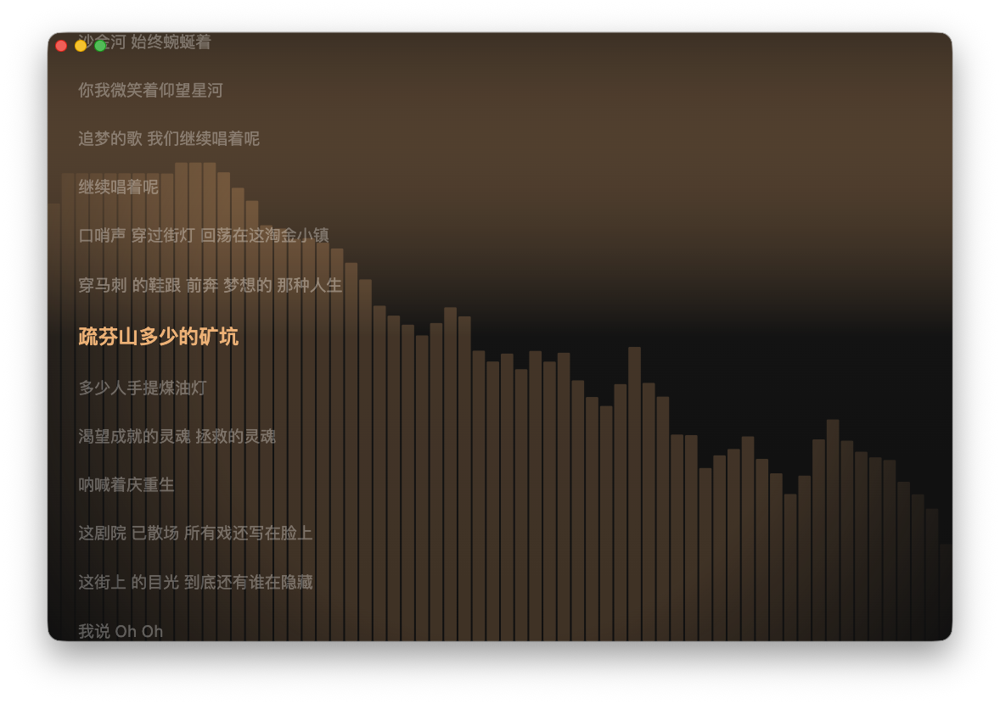
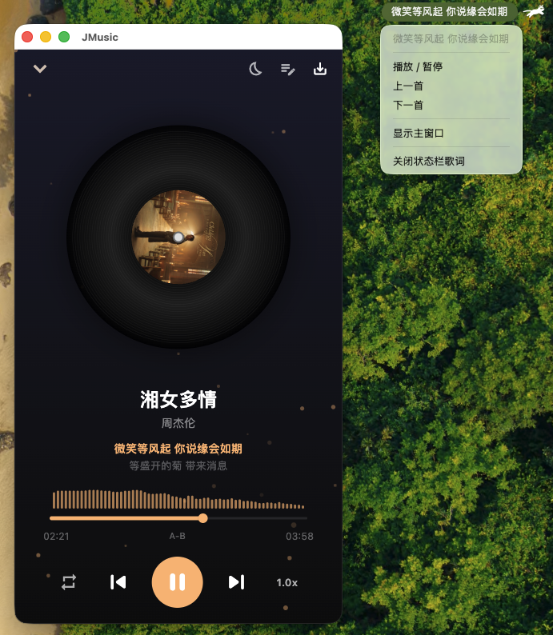
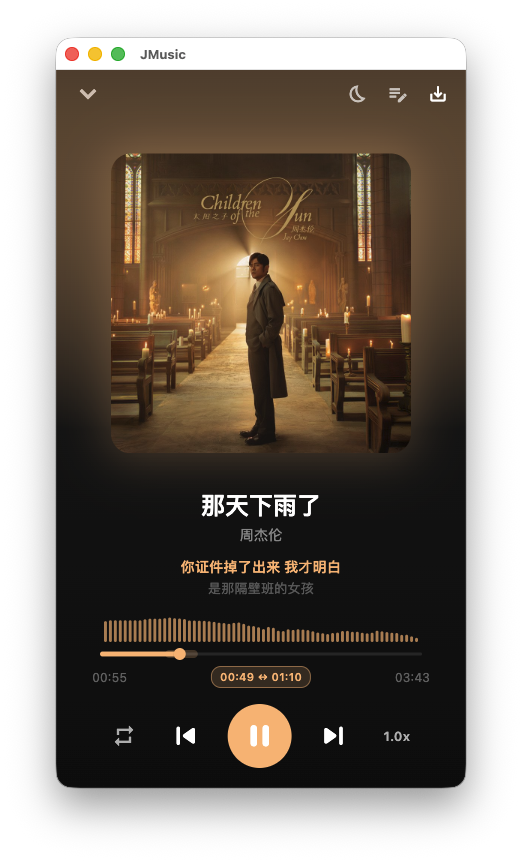
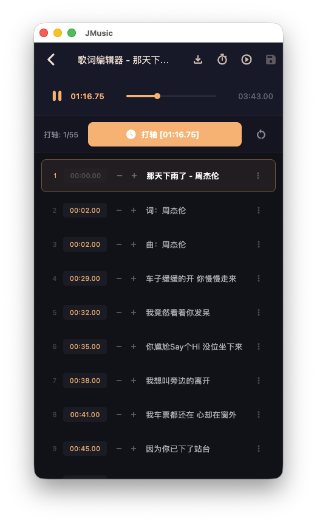
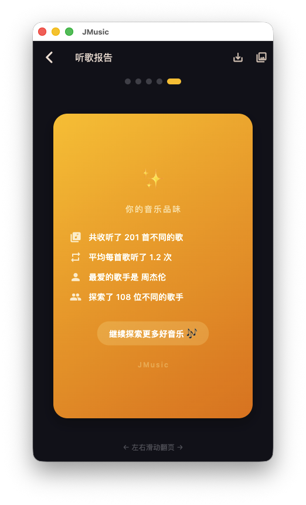
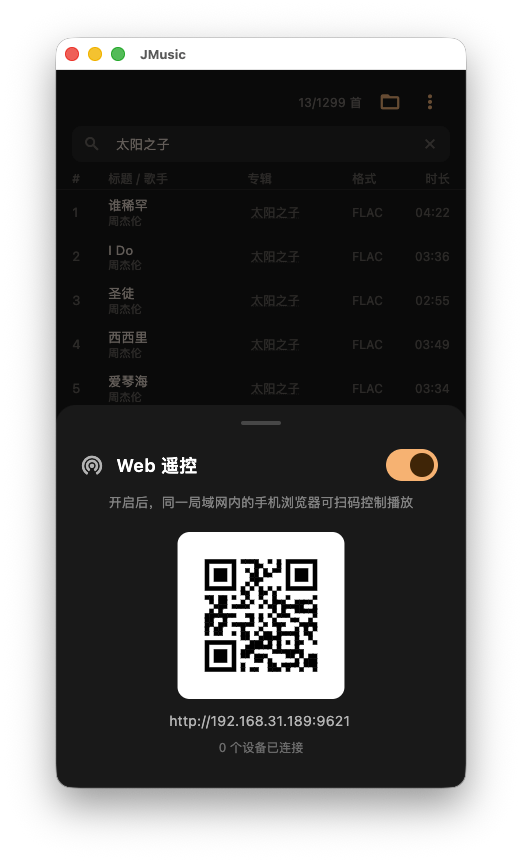
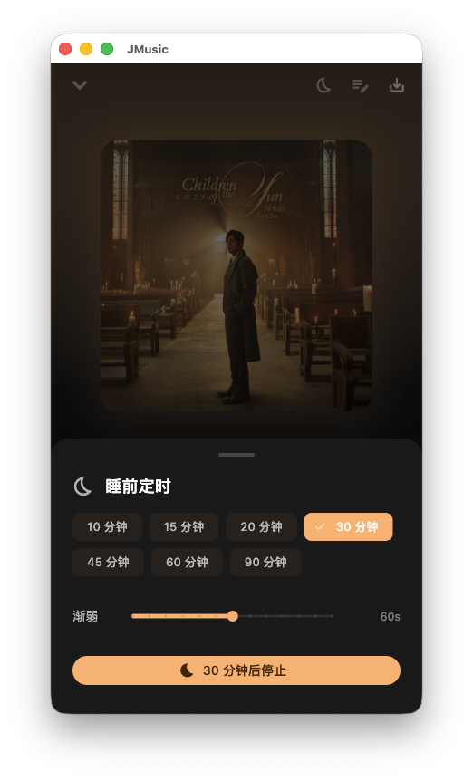
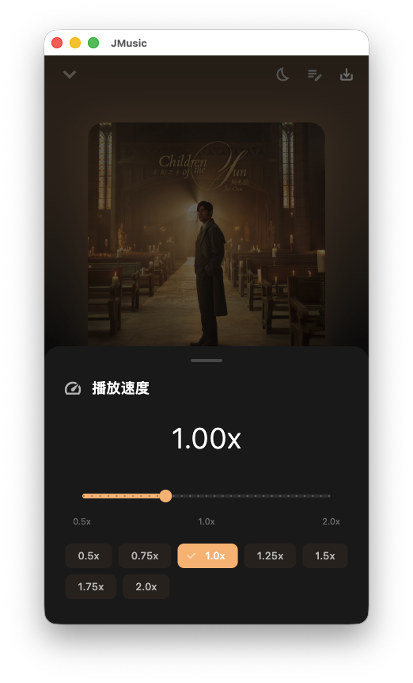

# 🎵 JMusic

一个使用 Flutter + Rust 构建的跨平台本地音乐播放器，支持在线歌词和专辑封面获取。

## ✨ 功能特性

- 🎶 **本地音乐播放** — 支持 MP3 / FLAC / WAV / OGG 等主流格式
- 📂 **目录扫描** — 选择音乐目录自动扫描并建立歌曲库
- ☁️ **WebDAV 音乐源** — 添加 WebDAV 地址（坚果云/Nextcloud/NAS）直接播放云端音乐，自动本地缓存
- 🔍 **在线匹配** — ~~自动从 QQ 音乐搜索匹配歌曲信息~~（可能失效，使用手动编辑并写入到源文件）
- 📝 **歌词同步** — ~~在线获取 LRC 歌词，逐行高亮滚动~~（可能失效，使用手动导入歌词并写入到源文件）
- 🖼️ **专辑封面** — ~~自动获取高清专辑封面~~（可能失效，使用手动导入专辑封面并写入到源文件）
- 🔁 **播放模式** — 顺序播放 / 单曲循环 / 随机播放
- ⏩ **变速播放** — 0.5x~2.0x 播放速度调节，适合播客/学习场景；预设按钮 + 滑块精细控制
- 😴 **睡前定时** — 10~90 分钟定时停止，支持渐弱音量（最后 N 秒线性降低），可延时
- 🖥️ **全屏歌词** — 沉浸式歌词浏览，支持长歌词自动换行左对齐并平滑滚动居中
- 🎤 **桌面悬浮歌词**（Windows）— 透明置顶窗口实时显示当前歌词+下一行，支持拖拽定位、字号调节、鼠标穿透锁定
- 🍎 **菜单栏歌词**（macOS）— 系统状态栏实时显示当前歌词，可通过状态栏菜单完成播放/暂停、上一首、下一首、显示主窗口、关闭等操作；关闭主窗口仅隐藏，应用继续在后台运行
- 📊 **音频可视化频谱** — 实时 FFT 频谱分析（Rust 端 2048 点 realfft，Android 端 Visualizer，均处理为 64 对数分箱），柱状频谱与进度条融为一体，使用非对称 IIR 时域平滑滤波实现 60 FPS 平滑动画
- 🎨 **动态主题色** — 自动从专辑封面提取主色调，整个 UI 配色（按钮、进度条、频谱、渐变背景）跟随当前歌曲动态切换，Material You 风格
- 🎭 **播放页视觉风格** — 三种可选风格：标准渐变 / 封面高斯模糊背景 / 黑胶唱片旋转+粒子效果；点击封面区域切换
- 🃏 **歌词卡片分享** — 全屏歌词页长按任意歌词行，生成精美分享卡片（封面模糊背景 + 歌词 + 歌曲信息 + 官网二维码），可导出为高清 PNG 图片
- 📡 **Web 遥控** — 局域网内手机浏览器扫码控制播放（HTTP + WebSocket，端口 9621），支持播放/暂停、切歌、音量、进度拖拽、播放列表选曲
- 🔁 **A-B 复读循环** — 选段循环播放，适合扒谱/学语言；点击设 A/B 点，进度条高亮区间，到达 B 点自动跳回 A 点，长按清除
- ✏️ **歌词编辑器** — 手动调时间轴的 LRC 编辑器；边播放边逐行打轴、±100ms 微调、整体时间偏移、导入纯文本/LRC、导出并内嵌到音频文件
- 📊 **听歌报告** — Spotify Wrapped 风格的听歌统计报告，5 页卡片翻页展示（总览/最爱歌曲/TOP5/歌手排行/总结），支持导出高清 PNG 图片分享
- 📺 **DLNA 投放** — SSDP 自动发现局域网智能音箱/电视，UPnP 推流播放，支持播放控制、进度同步、音量调节
- 📅 **听歌打卡日历** — GitHub 贡献图风格热力图，记录每日听歌时长，显示连续打卡天数和最近 7 天详情
- 🏷️ **自定义标签** — 给歌曲打标签（"开车"、"工作"、"清晨"等），搜索框下方横向 Chips 快速多标签筛选，筛选结果自动同步播放列表
- 🔄 **音频格式转换** — 支持右键本地/云端 WebDAV 歌曲，一键转码并导出为 MP3 / FLAC / WAV 格式；配备精美的主题配色彩卡单选、下载与转码状态加载提示，转码过程在 Rust 端通过纯 Rust 依赖的独立线程在后台执行，不卡顿 UI，成功后支持在系统文件管理器中一键高亮定位。

## 📸 应用截图

> 截图存放于项目根目录的 `screenshots/` 文件夹下。如需更新，替换对应文件即可。

### 主界面

|              主页 / 歌曲库              |             播放页 / 歌词              |
| :-------------------------------------: | :------------------------------------: |
|  |  |

### 沉浸式与桌面歌词

|             全屏歌词              |            桌面悬浮歌词（Windows）             |
| :-------------------------------: | :--------------------------------------------: |
|  |  |

### macOS 菜单栏歌词

<p align="center">
  
</p>

### A-B 复读 & 歌词编辑器

|             A-B 复读循环              |             歌词编辑器（打轴）              |
| :-----------------------------------: | :----------------------------------------: |
|  |  |

### 听歌报告与远程控制

|             报告总览              |             Web 遥控              |
| :-------------------------------: | :---------------------------------: |
|  |  |

### 听歌报告与变速播放

|             定时关闭              |             变速播放              |
| :-------------------------------: | :---------------------------------: |
|  |  |

## 🏗️ 技术架构

| 层级     | 技术                | 说明                              |
| -------- | ------------------- | --------------------------------- |
| **UI**   | Flutter + Riverpod  | Material 3 动态主题（封面色提取） |
| **桥接** | flutter_rust_bridge | Dart ↔ Rust FFI                   |
| **核心** | Rust                | 音频解码、频谱分析、网络请求、文件扫描 |

### Rust 核心模块

```
rust/src/
├── api/          # FFI 接口（player、scanner、metadata）
├── audio/        # 音频播放引擎（rodio）+ 频谱分析（realfft）
├── network/      # QQ 音乐 API 客户端（reqwest）
├── models/       # 数据模型（Song、Lyrics、Library）
└── storage/      # 本地持久化（JSON）
```

### Flutter UI 结构

```
lib/
├── main.dart             # 入口（动态主题）
├── pages/
│   ├── home_page.dart    # 歌曲库列表
│   ├── player_page.dart  # 播放页（三种视觉风格）+ 全屏歌词
│   ├── play_stats_page.dart      # 播放统计
│   ├── lyrics_editor_page.dart   # 歌词编辑器（LRC 打轴）
│   ├── listening_report_page.dart # 听歌报告（Wrapped 风格）
│   └── listening_calendar_page.dart # 听歌打卡日历（GitHub 贡献图风）
├── services/
│   ├── web_remote.dart        # Web 遥控 HTTP+WebSocket 服务器
│   ├── web_remote_html.dart   # 遥控页面内嵌 HTML
│   ├── webdav_service.dart    # WebDAV 协议通信（列目录/下载/缓存）
│   ├── dlna_service.dart      # DLNA 设备发现（SSDP）+ UPnP 控制（SOAP）
│   ├── media_stream_server.dart   # 本地 HTTP 媒体流服务器（为 DLNA 设备提供音频）
│   ├── listening_calendar_service.dart # 听歌日历数据持久化
│   └── song_tag_service.dart  # 歌曲标签管理与持久化
├── widgets/
│   ├── mini_player.dart       # 底部迷你播放栏
│   ├── lyrics_view.dart       # 歌词滚动组件（支持长按分享）
│   ├── lyrics_card.dart       # 歌词卡片生成与导出
│   ├── spectrum_view.dart     # 频谱可视化组件（柱状）
│   ├── vinyl_disc.dart        # 黑胶唱片旋转组件
│   ├── particles_bg.dart      # 粒子背景动画
│   ├── web_remote_sheet.dart  # Web 遥控管理面板
│   ├── webdav_sheet.dart      # WebDAV 音乐源管理面板
│   ├── sleep_timer_sheet.dart # 睡前定时器面板
│   ├── speed_control_sheet.dart # 变速控制面板
│   ├── cast_sheet.dart        # DLNA 投放设备选择面板
│   ├── song_tag_sheet.dart    # 歌曲标签编辑面板
│   └── export_dialog.dart     # 音频转码导出对话框
└── providers/
    ├── app_providers.dart      # Riverpod 状态管理（播放器+歌曲库）
    ├── spectrum.dart           # 频谱常量
    ├── dynamic_theme.dart      # 封面色提取动态主题
    ├── player_style.dart       # 播放页视觉风格（标准/模糊/黑胶）
    ├── playback_speed.dart     # 播放速度控制
    ├── sleep_timer.dart        # 睡前定时器
    ├── web_remote_provider.dart # Web 遥控服务状态
    ├── webdav_provider.dart    # WebDAV 音乐源状态
    ├── cast_provider.dart      # DLNA 投放状态管理
    ├── song_tag_provider.dart  # 歌曲标签筛选状态
    └── macos_status_bar.dart   # macOS 菜单栏歌词控制器
```

### macOS 原生模块

```
macos/Runner/
├── AppDelegate.swift                  # 启动注册 / 关闭按钮策略 / Dock 重新激活 / 退出清理
├── MainFlutterWindow.swift            # 在 awakeFromNib 中 attach 状态栏歌词控制器
├── MainWindowDelegate.swift           # windowShouldClose 拦截：关闭=隐藏不退出
└── StatusBarLyricsController.swift    # NSStatusItem + NSMenu + setText 去重
```

菜单栏歌词的 Dart 端通过 `MethodChannel('com.jmusic.app/macos_status_bar')` 与 Swift 端通信：Dart 推送 `setEnabled / setText / showMainWindow / dispose`，Swift 端把菜单点击通过 `onMenuAction` 回送给 Dart。偏好以 Dart 端 `SharedPreferences` 为唯一来源，键为 `status_bar_lyrics_enabled`，默认启用。

## 📦 下载与安装 (macOS)

您可以直接从 GitHub Releases 下载已打包好的 Mac 版本：

1. 下载 `JMusic-mac.zip` 并解压得到应用文件。
2. **⚠️ 兼容性注意**：当前发布的版本**仅兼容搭载 Apple Silicon (M1/M2/M3等 M系列芯片)** 的 Mac，暂不支持 Intel 芯片的 Mac 电脑。
3. **遇到“应用已损坏”或“无法验证开发者”怎么办？**
   由于应用未经过 Apple 开发者签名公证，首次打开时会被 macOS 拦截。请打开**终端 (Terminal)**，执行以下命令移除安全隔离属性：
   ```bash
   xattr -cr /你的解压路径/你的应用名称.app
   ```
   _(小提示：你可以先输入 `xattr -cr ` —— 注意结尾有个空格，然后把解压出来的 app 文件直接拖进终端窗口，再按回车键即可)_

## 🛠️ 本地开发与构建

### 环境要求

- Flutter SDK ≥ 3.11
- Rust toolchain（`rustup`）
- macOS: Xcode + CocoaPods
- Android:
  - **Android SDK** 和 **JDK 17** (通常通过安装 Android Studio 自动配置)
  - **Android NDK** (需要在 Android Studio 的 SDK Manager -> SDK Tools 中勾选 `NDK (Side by side)` 进行安装)
  - **Rust Android 跨平台编译目标**:
    ```bash
    rustup target add aarch64-linux-android armv7-linux-androideabi x86_64-linux-android i686-linux-android
    ```

### 运行

```bash
# 安装依赖
flutter pub get

# macOS
cd macos && pod install && cd ..
flutter run -d macos

# 其他平台
flutter run -d windows
flutter run -d linux
flutter run -d <android-device-id> # 运行到安卓设备或模拟器
```

### 构建

```bash
flutter build macos
flutter build windows
flutter build linux
flutter build apk         # 构建 Android APK 包
flutter build appbundle   # 构建 Google Play 的 AAB 格式包
# 彻底清理缓存并重新构建（当遇到桥接代码哈希值不匹配、Bad state 等报错时使用）
# 1. 清理 Rust 编译缓存
cd rust
cargo clean
cd ..
# 2. 清理 Android 构建缓存 (如果本地未配置 Java 环境变量，此步可跳过)
cd android
./gradlew clean
cd ..
# 3. 清理 Flutter 缓存并重新生成桥接代码（确保在项目根目录下运行）
flutter clean
flutter_rust_bridge_codegen generate
# 4. 重新构建（建议在手机/模拟器上先手动卸载旧版本，防止动态库缓存残留）
flutter build apk
```

### 🖼️ 更新应用图标

如果需要更换或更新应用图标，请将新的正方形图标图片放置于根目录的 `assets/icon.png` 下，然后运行以下命令自动生成各平台图标：

```bash
flutter pub run flutter_launcher_icons
```

生成完毕后，如果你正在运行程序，需要停止 (`q`) 然后重新运行 `flutter run -d <platform>` 或构建才能看到新图标！

## 📄 License

MIT
